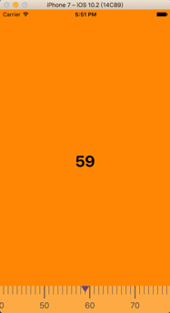

## Introduction

Simple ruler input control.



## Installation

### Requirement

iOS 8+

### [CocoaPods](http://cocoapods.org)

To install DTRuler add a dependency to your Podfile:

```
pod "DTRuler"
```

### [Carthage](https://github.com/Carthage/Carthage)

To install DTRuler add a dependency to your Cartfile:

```
github "danjiang/DTRuler"
```

```
carthage update --platform ios
```

## Usage

### Import

```swift
import DTRuler
```

### Use

```swift
// Float with step as 0.1
let scale = 78.9
let ruler = DTRuler(scale: .float(scale), minScale: .float(9), maxScale: .float(999))

// or Integer with step as 1
let scale = 59
let ruler = DTRuler(scale: .integer(scale), minScale: .integer(10), maxScale: .integer(100))

ruler.delegate = self

extension ViewController: DTRulerDelegate {
  
  func didChange(on ruler: DTRuler, withScale scale: DTRuler.Scale) {
    switch scale {
    case .float(let f):
      print(f)
    case .integer(let i):
      print(i)
  }

}
```

### Customize

```swift
struct Colorful: DTRulerTheme {
  
  var backgroundColor: UIColor {
    return UIColor.lightGray
  }
  
  var pointerColor: UIColor {
      return UIColor.gray
  }
  
  var majorScaleColor: UIColor {
    return UIColor.darkGray
  }
  
  var minorScaleColor: UIColor {
    return UIColor.darkGray
  }
  
  var labelColor: UIColor {
    return UIColor.darkGray
  }
  
}

DTRuler.theme = Colorful()
```

